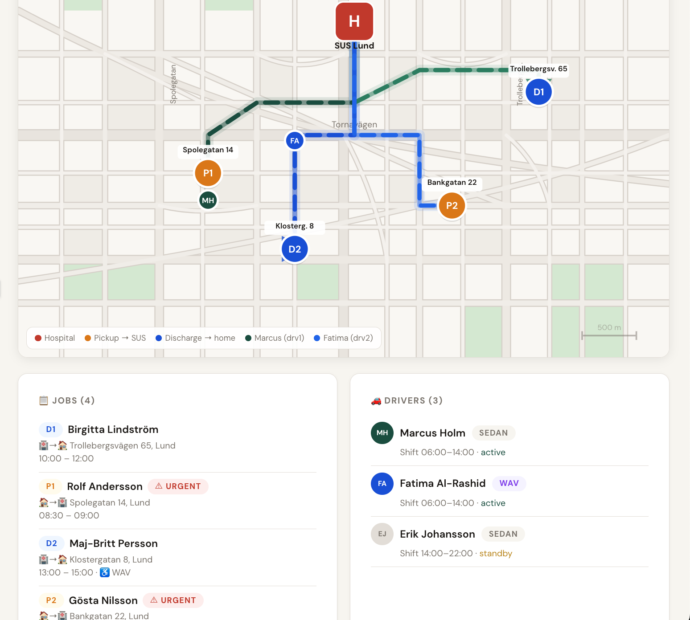

# Wing13

**AI-powered patient transport coordination for Swedish hospital wards.**

Wing13 serves as the middle man in patient transportation by reducing delays, improving driver utilisation, and enabling faster patient discharge.

---

## Problem

Hospital transport coordination is often manual and time-consuming, dependent on phone calls between wards and dispatch. This leads to inefficient pick up and drop offs and missed same-day discharges which cost an estimate of 10k sek per patient. Taking SUS as an example, 250 inpatients are discharged daily, 30-50% require hospital provided transport. 

---

## Solution

Wing13 acts as a middlelayer seeking to reduce wait time for patient and take advantage of trips planned by the hospital. 

---

## 🧩 System Architecture

```id="arch1"
Nurse emails (.txt)
        ↓
[Step 1] AI Parsing (Claude)
        ↓
Structured Job JSON
        ↓
[Step 2] AI Optimisation (Claude)
        ↓
Driver Assignments + Routes
        ↓
[Step 3] Dispatch Generation
        ↓
Dispatch Email

        ↑
   System State
(drivers, assignments)
```

---

## How it works

### Three API calls, one pipeline

| Step        | Input                         | AI does                               | Output              |
| ----------- | ----------------------------- | ------------------------------------- | ------------------- |
| 1. Parse    | Raw email                     | Extract patient, address, time window | Structured job JSON |
| 2. Optimise | Jobs + drivers + travel times | Assign drivers, sequence routes       | Dispatch plan JSON  |
| 3. Dispatch | Dispatch plan                 | Generate human-readable email         | Email output        |

---

## 🖼 Demo

### 📩 Example Email Input

*Add screenshot of email*


---

### 🧠 Parsed Jobs (AI Output)

*Add JSON output screenshot*


---

### 🗺 Route Planning / Map

*Add route visualisation*



---

### 📧 Dispatch Output

*Add dispatch email screenshot*


---

## 🖥 UI Demo (Product Preview)

A React-based UI demo is included to visualise how dispatchers would interact with the system.

It shows:

* Incoming jobs
* Driver assignments
* Route planning overview

```bash id="runui"
cd demo-ui
npm install
npm start
```

### ⚠️ Note

The UI currently uses **mock data for demonstration purposes**.
It represents how the system would behave when connected to the live pipeline.

---

### UI Preview

*Add screenshot of your UI*


---

## 🗂 Project Structure

```id="struct1"
wing13/
├── src/
│   ├── pipeline.js        # Main pipeline
│   ├── step1_parse.js     # Email → structured jobs (AI)
│   ├── step2_optimise.js  # Route optimisation (AI)
│   ├── step3_dispatch.js  # Dispatch email generation
│   └── state.js           # System state
│
├── demo-ui/               # React UI (mock data demo)
├── emails/                # Input email files
├── assets/                # Screenshots for README
├── state.json             # Persistent system state
├── traveltime.py          # Real routing (OSRM prototype)
├── .env.example
└── package.json
```

---

## ▶️ Quick start

```bash id="runmain"
# 1. Install dependencies
npm install

# 2. Set API key
cp .env.example .env
# Add your ANTHROPIC_API_KEY

# 3. Add emails to /emails

# 4. Run pipeline
npm start
```

---

## 📩 Example Emails

Wing13 works with natural language — no strict format required.

**Discharge (hospital → home):**

> “Birgitta Lindström is ready to go home. She lives at Trollebergsvägen 65, Lund and is available from 10:00.”

**Pickup (home → hospital):**

> “Rolf Andersson needs to be at SUS Lund for his 09:30 appointment. Pick him up from Spolegatan 14 between 08:30 and 09:00.”

---

## Real-World Integration

For demo reliability, travel times are mocked.

A routing module is included:

**`traveltime.py`**

* Uses OpenStreetMap + OSRM
* Computes real driving times
* Can replace the mock routing layer

---

## ⚠️ Limitations

* Static `.txt` emails (no live inbox)
* Mock travel times
* No real-time updates
* UI uses mock data

---

## GDPR Considerations

Wing13 processes patient data (names and addresses).

In production:

* Use EU-hosted infrastructure
* Sign Data Processing Agreements
* Auto-delete patient data after transport
* Maintain audit logs

---

## Tech Stack

* Node.js
* Claude (Anthropic API)
* Python (OSRM routing prototype)
* React (UI demo)

---